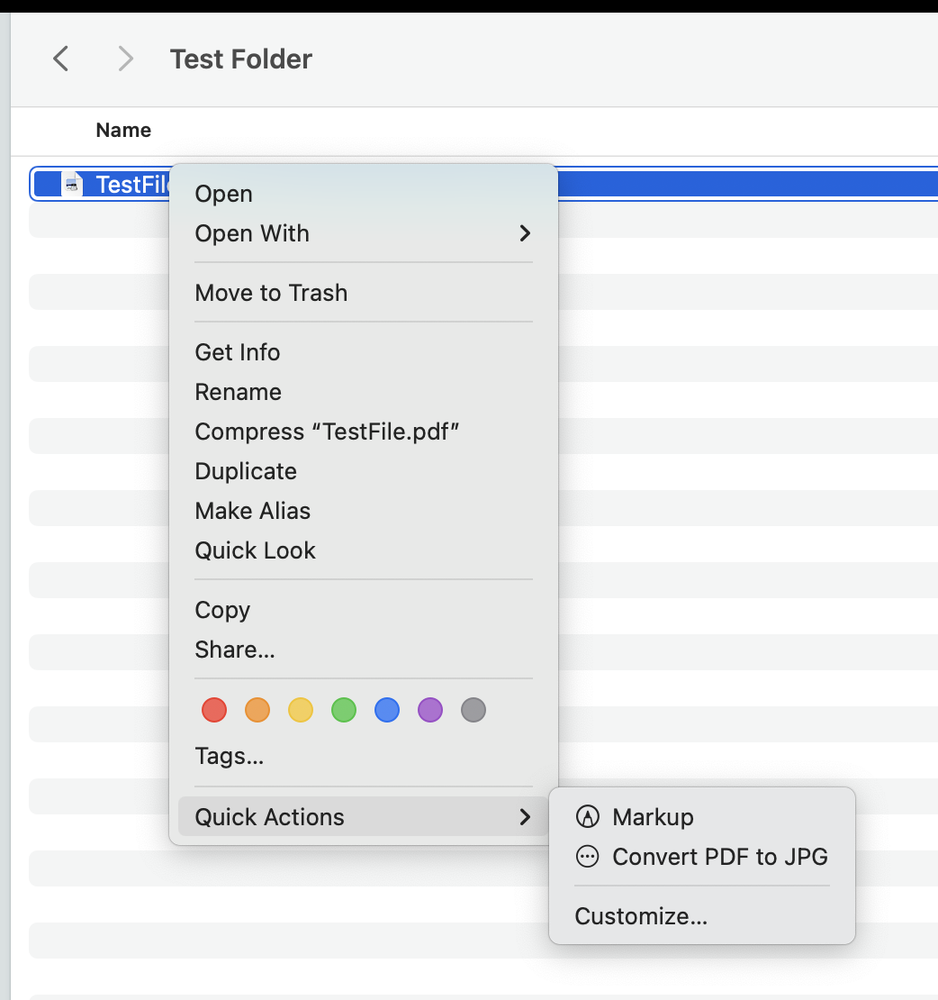
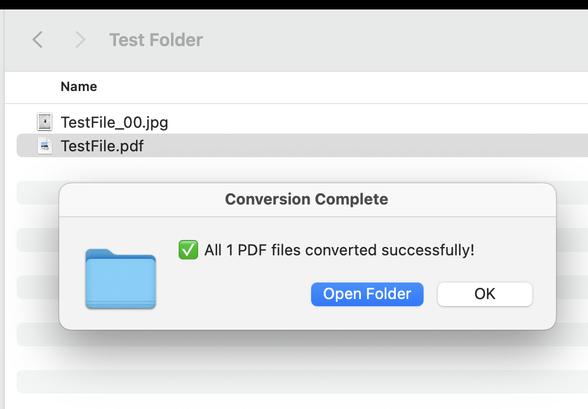

# ConvertPDF2JPGAutomator
Automator Quick Action to convert selected pdfs to jpg.

<ul>
  <li>Open Terminal app and install imagemagick tools <code>brew install imagemagick</code></li>
  <li>Copy the Convert PDF to JPG folder to ~/Library/Services 

</li>
  <li>You should see the finder context menu by Right-Click -> Quick Action -> Convert PDf to JPG selection show up on PDF files
  

</li>
</li>
</ul>

